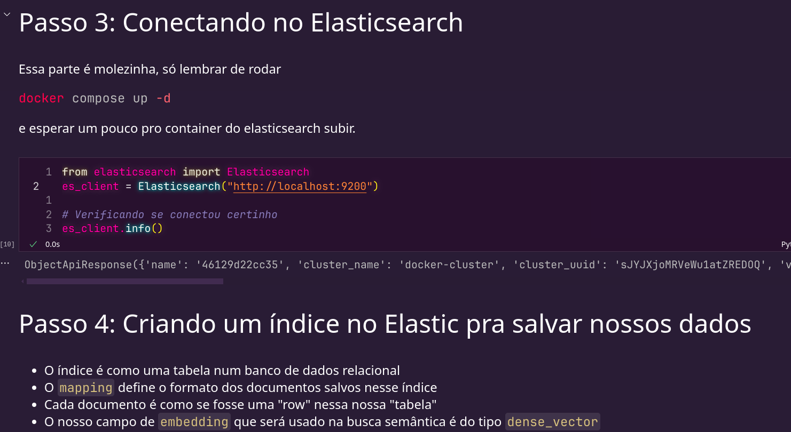

A ideia é basicamente ser um amontoado de jupyter notebooks sobre coisas interessantes que eu vou achando por aí sobre RAG, busca semântica e LLMs.


## Setup
Os artigos/notebooks ficam em arquivos ipynb.
Pra rodar o elasticsearch, eu criei um script em docker-compose que sobe uma imagem de elasticsearch e Kibana.

### Subindo o elasticsearch
Esses containers já têm volumes, então você não precisa reindexar os documentos e recriar os indices a cada vez que subir o projeto

Só rodar

```bash
docker compose up -d
```

### Configurando o python e subindo o jupyter notebook

(Opcional) Crie um ambiente virtual com venv. Caso você não deseje ter risco de conflitar com algum pacote já instalado na máquina

```bash
python -m venv .venv
source .venv/bin/activate
```

Pra instalar as dependências do projeto, basta rodar 
```bash
pip install -r requirements.txt
```
E por fim, pra rodar o notebook, você pode fazer via vscode com a extensão do jupyter, ou então rodar o comando abaixo no terminal, que vai rodar o jupyter e expor uma porta pra você acessar no navegador e mexer como se fosse o google collab.
```bash
jupyter notebook
```

Mas como eu disse, eu prefiro mil vezes usar o jupyter dentro do vscode
